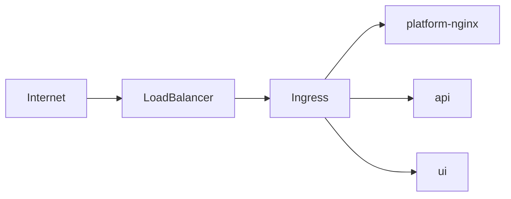
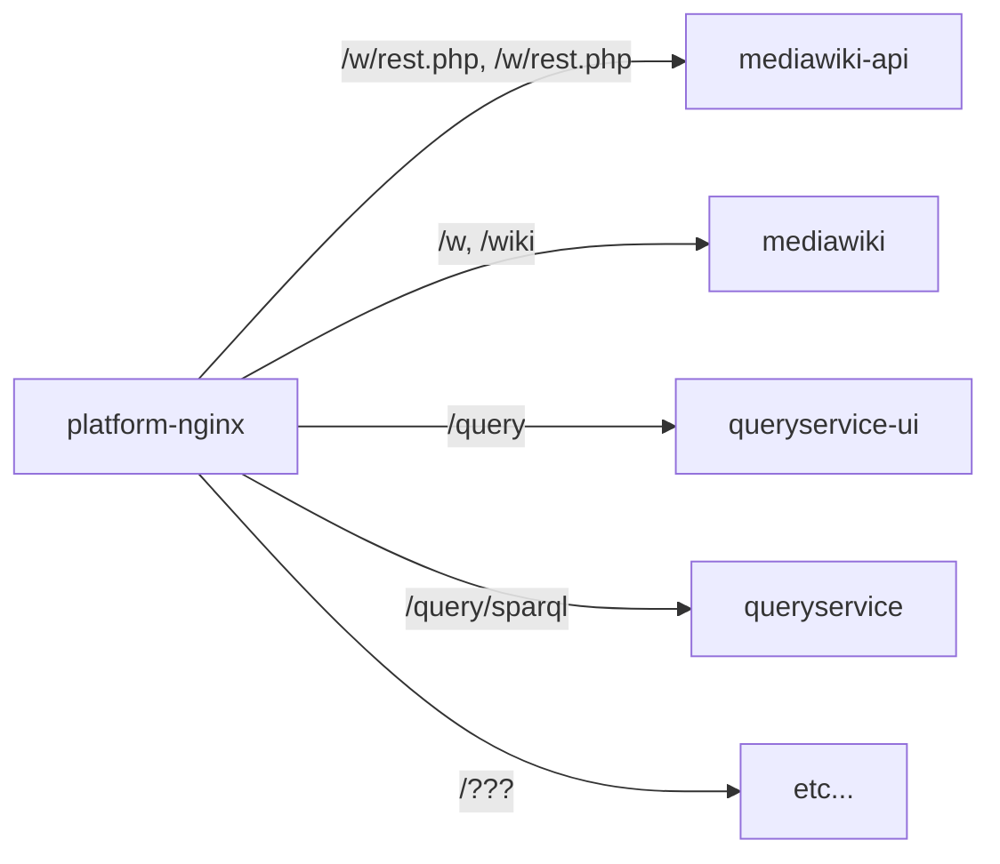

# Infrastructure Services

Infrastructures Services are not part of the main platform, but are used by it.

## ingress

[Ingress](https://kubernetes.io/docs/concepts/services-networking/ingress/#what-is-ingress) is a Kubernetes concept that exposes HTTP and HTTPS routes from outside the cluster to services within the cluster.

The ingress attaches to a LoadBalancer provided by Google Cloud.

**Sequence:**

1) The internet makes requests through a cloud provided load balancer.
2) That load balancer passes all requests through to the Ingress on Kubernetes.
3) The Ingress terminates HTTPs and routes traffic to the appropriate service.

## cert-manager

[cert-manager](https://cert-manager.io/) provides automatic certificate management in Kubernetes.

This is used in conjunction with the [Ingress](#ingress).

## platform-nginx

[Nginx](https://www.nginx.com/) is used as a reverse proxy layer to perform path based routing to difference services for sites hosted on wbstack.

Requests to platform services such as the main UI or API do not go via this layer.

The exact routing can be seen in nginx.conf
## sql

An sql service running MariaDB operates for both the main platform API and MediaWiki sites.

This is currently setup with replication enabled.

## redis

Redis is used by a variety of deployed services for:

- caching
- queues
- shared sessions
