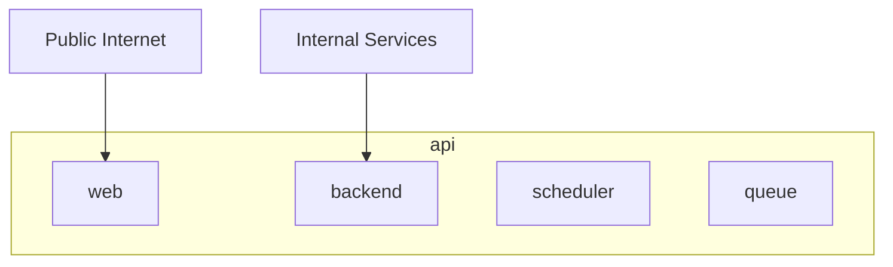
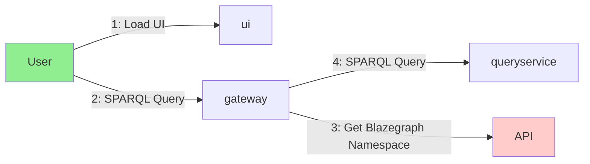
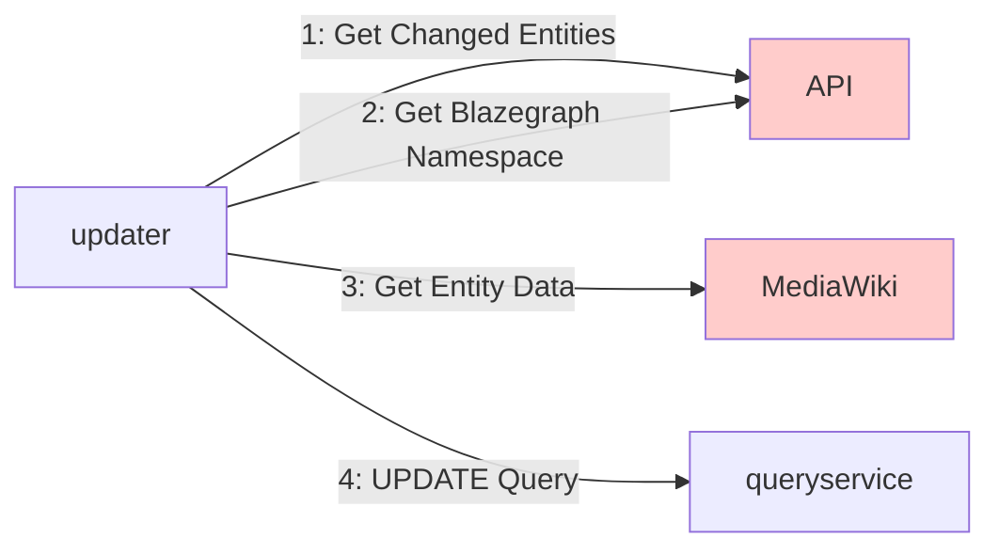
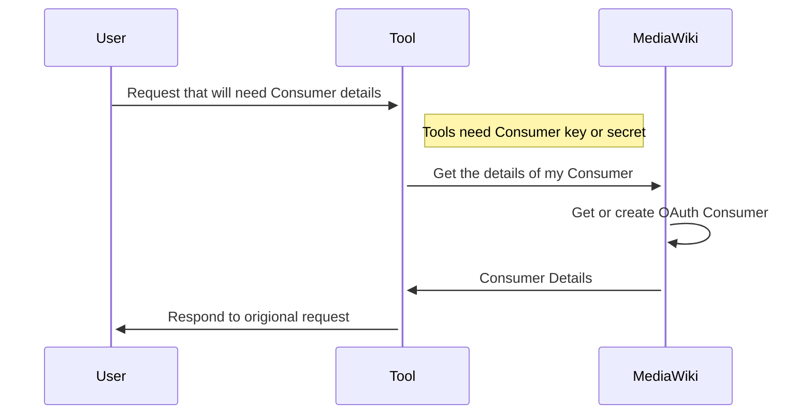

# Platform Services

## Platform

The main part of the platform is made up of a single [API](https://github.com/wbstack/api) and [UI](https://github.com/wbstack/ui).

The UI is a simple Vue site providing a graphical interface to the main API.

The API is a PHP application (built using [Lumen](https://lumen.laravel.com/)) containing most of the logic managing the platform as a whole.

- **Platform users**: invitation, verification, authentication
- **Wiki sites**: creation, configuration, sql details, blazegraph details
- **Query service update hub**: Maintains a log of pages changed on all sites & creates batches of work for the queryservice updater.

It is deployed in a few parts:

- **web** - Publicly facing API
- **backend** - Internal backend only API
- **scheduler** - Cron system
- **queue** - Async job execution

The backend API is used by internal application to get infomation about the sites hosted on the platform.



## MediaWiki

[MediaWiki](https://github.com/wbstack/mediawiki) is deployed alongside many extensions and custom configuration.

One of the main modifications to MediaWiki is the entrypoints, all of which load code custom to wbstack before loading MediaWiki code.

For example `index.php` starts like this:

```php
<?php
// Load custom wbstack code
require_once __DIR__ . '/wikWikiInfoOrFail.php';
// Actual MediaWiki code below here...
```

This code makes a request to the platform API to get needed details.

## Queryservice

The queryservice is made up of a number of components:

- [queryservice](https://github.com/wbstack/queryservice) - Blazegraph SPARQL query service (WDQS flavour)
- [queryservice-gateway](https://github.com/wbstack/queryservice-gateway) - Custom gateway proxy to route traffic to the correct Blazegraph namespace based on request domain.
- [queryservice-updater](https://github.com/wbstack/queryservice-updater) - Custom updater to updater multiple sites from a single process.
- [queryservice-ui](https://github.com/wbstack/queryservice-ui) - Fork of the WDQS UI with modifications for wbstack.

For Requests:



For Updates:



## Magnus tools

The tools that are currently deployed are 
[quickstatements](https://github.com/wbstack/quickstatements),
[cradle](https://github.com/wbstack/cradle) and
[widar](https://github.com/wbstack/widar).

Each of these tools exist as fork of their originals with customizations for wbstack.

### Oauth Consumer

These tools use OAuth authentication for MediaWiki interactions.

OAuth consumer creation is automated using an internal only MediaWiki API action.

[magnustools](https://github.com/wbstack/magnustools) code, which is used by the tools, is overridden to fetch Consumer data from this API instead of an INI file ([code](https://github.com/wbstack/magnustools/blob/429f68414b98fed4800cc010b8813abb8d624eb5/public_html/php/WbstackMagnusOauth.php#L86-L131))


