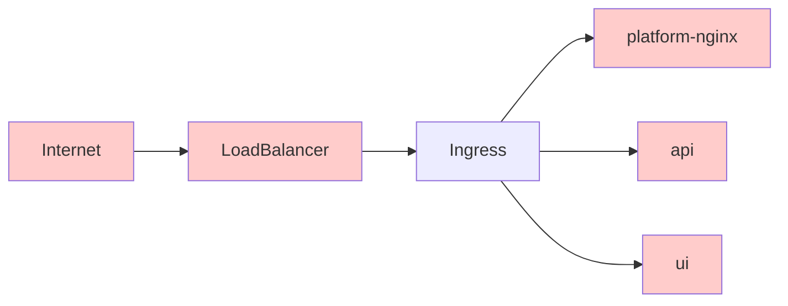

# Ingress

An NGINX ingress is currently used.

[Ingress](https://kubernetes.io/docs/concepts/services-networking/ingress/#what-is-ingress) is a Kubernetes concept that exposes HTTP and HTTPS routes from outside the cluster to services within the cluster.

The ingress attaches to a LoadBalancer provided by Google Cloud.

We deploy [this chart](https://hub.helm.sh/charts/stable/nginx-ingress) which deploys [this service](https://github.com/kubernetes/ingress-nginx).
The changelog for the service can be found [here](https://github.com/kubernetes/ingress-nginx/blob/master/Changelog.md).

**Sequence:**

1) The internet makes requests through a cloud provided load balancer.
2) That load balancer passes all requests through to the Ingress on Kubernetes.
3) The Ingress terminates HTTPs and routes traffic to the appropriate service.

### Update notes

Guidance for updating to new versions of the helm chart.

- Find a new version of the chart to update to
- Read the RELNOTES of the chart and also the service if needed
  - You can figure out if the service changes byt doing `helmfile diff`
- `helmfile apply` the update
- Make sure the ingress points still load
