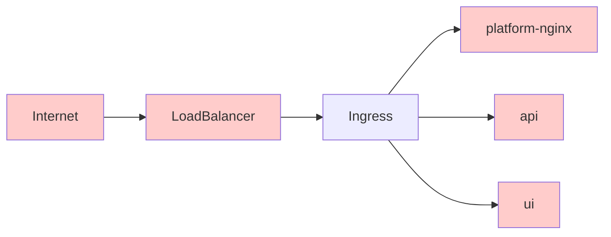

# Ingress

## ingress-nginx

[Ingress](https://kubernetes.io/docs/concepts/services-networking/ingress/#what-is-ingress) is a Kubernetes concept that exposes HTTP and HTTPS routes from outside the cluster to services within the cluster.

The ingress attaches to a LoadBalancer provided by Google Cloud.

We deploy [this chart](https://hub.helm.sh/charts/stable/nginx-ingress) which deploys [this service](https://github.com/kubernetes/ingress-nginx).
The changelog for the service can be found [here](https://github.com/kubernetes/ingress-nginx/blob/master/Changelog.md).

**Sequence:**

1) The internet makes requests through a cloud provided load balancer.
2) That load balancer passes all requests through to the Ingress on Kubernetes.
3) The Ingress terminates HTTPs and routes traffic to the appropriate service.



### Update notes

Guidance for updating to new versions of the helm chart.

- Find a new version of the chart to update to
- Read the RELNOTES of the chart and also the service if needed
  - You can figure out if the service changes byt doing `helmfile diff`
- `helmfile apply` the update
- Make sure the ingress points still load

## cert-manager

[cert-manager](https://cert-manager.io/) provides automatic certificate management in Kubernetes.

Reading:

- [Quickstart with nginx ingress](https://docs.cert-manager.io/en/release-0.10/tutorials/acme/quick-start/index.html)
- [gcloud dns01 docs](https://docs.cert-manager.io/en/latest/tasks/issuers/setup-acme/dns01/google.html)

### Debugging

[https://docs.cert-manager.io/en/latest/reference/orders.html](https://docs.cert-manager.io/en/latest/reference/orders.html)

See the certificate for the main domain:

```sh
kubectl describe certificate wbstack-com-tls
```

This will list the current status and any current orders that are occurring.

You can then get the details of the order:

```sh
kubectl describe order wbstack-com-tls-356876054
```

Which will list a collection of challenges.

You can see the details of the challenges

```sh
kubectl describe challenge wbstack-com-tls-356876054-0
kubectl describe challenge wbstack-com-tls-356876054-1
```

You can see if DNS challenges have made it to Google Cloud DNS by going to:

`https://console.cloud.google.com/net-services/dns?cloudshell=false&project=<projectname>`
