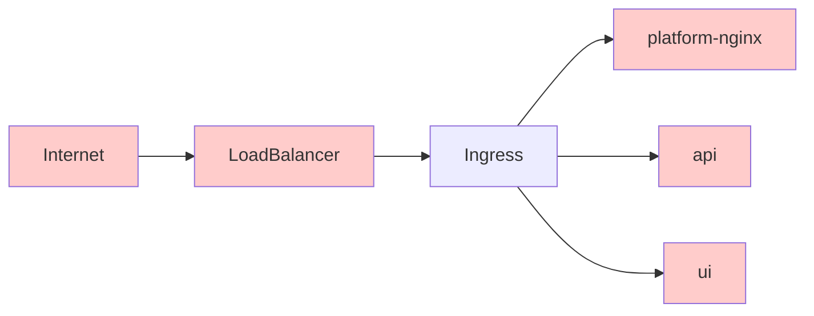

# Ingress

## ingress-nginx

[Ingress](https://kubernetes.io/docs/concepts/services-networking/ingress/#what-is-ingress) is a Kubernetes concept that exposes HTTP and HTTPS routes from outside the cluster to services within the cluster.

The ingress attaches to a LoadBalancer provided by Google Cloud.

**Sequence:**

1) The internet makes requests through a cloud provided load balancer.
2) That load balancer passes all requests through to the Ingress on Kubernetes.
3) The Ingress terminates HTTPs and routes traffic to the appropriate service.

## cert-manager

[cert-manager](https://cert-manager.io/) provides automatic certificate management in Kubernetes.