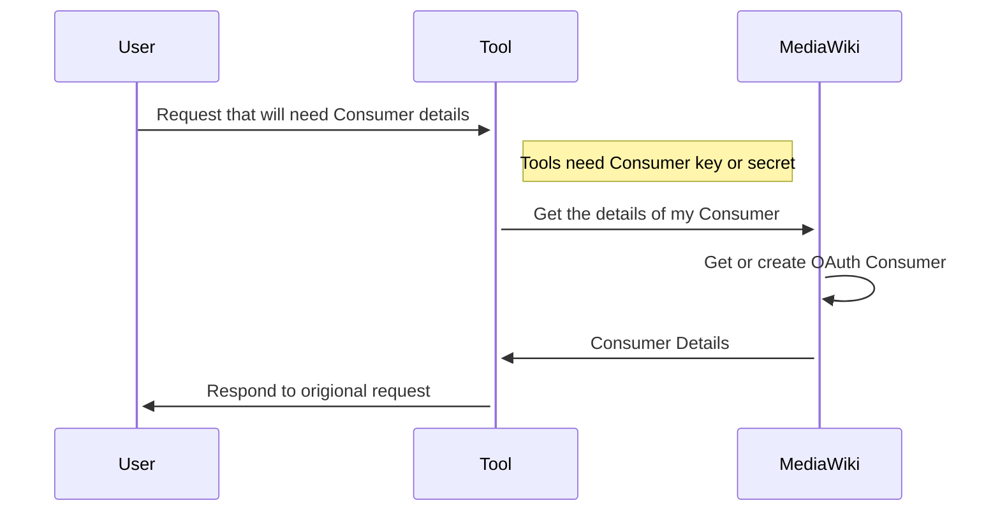

# Magnus Tools

The tools that are currently deployed are 
[quickstatements](https://github.com/wbstack/quickstatements),
[cradle](https://github.com/wbstack/cradle) and
[widar](https://github.com/wbstack/widar).

Each of these tools exist as fork of their originals with customizations for wbstack.

## Oauth Consumers

These tools use OAuth authentication for MediaWiki interactions.

OAuth consumer creation is automated using an internal only MediaWiki API action.

[magnustools](https://github.com/wbstack/magnustools) code, which is used by the tools, is overridden to fetch Consumer data from this API instead of an INI file ([code](https://github.com/wbstack/magnustools/blob/429f68414b98fed4800cc010b8813abb8d624eb5/public_html/php/WbstackMagnusOauth.php#L86-L131))

## tools-quickstatements

## tools-cradle

## tools-widar
