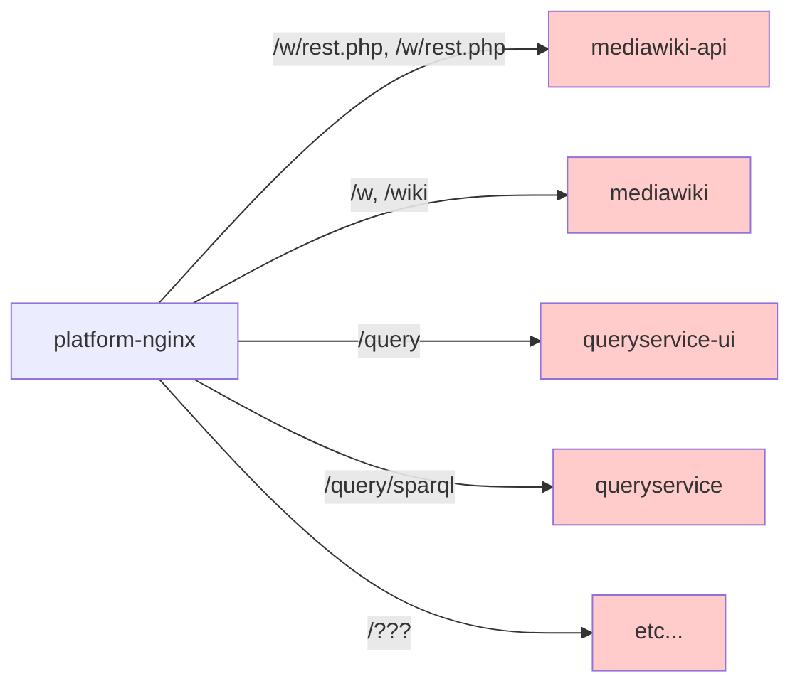

# Platform Nginx

[Nginx](https://www.nginx.com/) is used as a reverse proxy layer to perform path based routing to difference services for sites hosted on wbstack.

Requests to platform services such as the management UI or API do not go via this layer.

The exact routing can be seen in nginx.conf