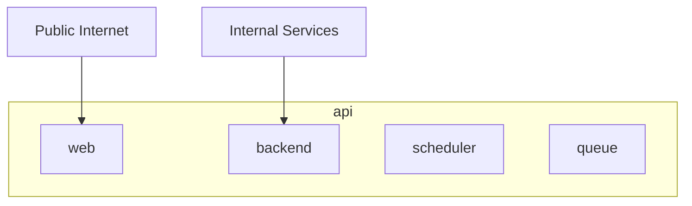

# Platform

The main part of the platform is made up of a single [API](https://github.com/wbstack/api) and [UI](https://github.com/wbstack/ui).

The UI is a simple VueJS site providing a graphical interface to the main API.

The API is a PHP application (built using [Laravel](https://laravel.com/)) containing most of the logic managing the platform as a whole.

- **Platform users**: invitation, verification, authentication
- **Wiki sites**: creation, configuration, sql details, blazegraph details
- **Query service update hub**: Maintains a log of pages changed on all sites & creates batches of work for the queryservice updater.

It is deployed in a few parts:

- **web** - Publicly facing API
- **backend** - Internal backend only API
- **scheduler** - Cron system
- **queue** - Async job execution

The backend API is used by internal application to get infomation about the sites hosted on the platform.

## api

## ui
