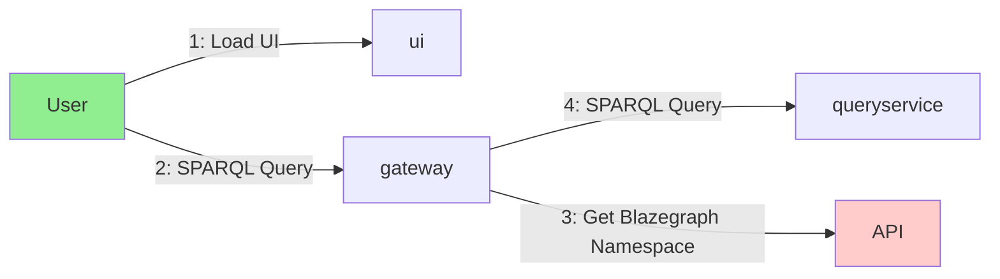
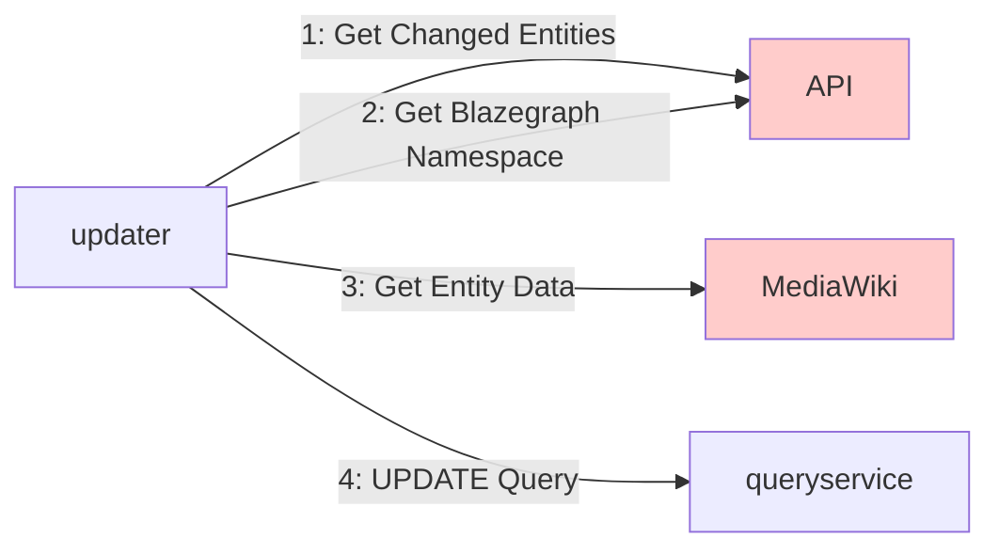

# Queryservice

The queryservice is made up of a number of components:

- [queryservice](https://github.com/wbstack/queryservice) - Blazegraph SPARQL query service (WDQS flavour)
- [queryservice-gateway](https://github.com/wbstack/queryservice-gateway) - Custom gateway proxy to route traffic to the correct Blazegraph namespace based on request domain.
- [queryservice-updater](https://github.com/wbstack/queryservice-updater) - Custom updater to updater multiple sites from a single process.
- [queryservice-ui](https://github.com/wbstack/queryservice-ui) - Fork of the WDQS UI with modifications for wbstack.

For Requests:

For Updates:

## queryservice

## queryservice-gateway

## queryservice-ui

## queryservice-updater
